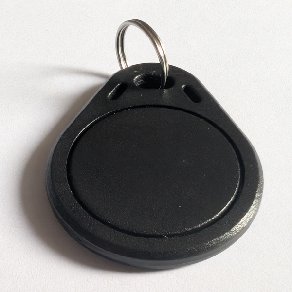

# NFC

## [nfc_tag_chip_keyring.stl](nfc_tag_chip_keyring.stl)

This file is a model of a NFC tag keyfob/keychain/keyring. It is
hollow so that the a chip could fit inside. This file was found on
[Printables](https://www.printables.com/model/361823-nfc-tag-25mm).

## [nfc_tag_sticker_keyring.stl](nfc_tag_sticker_keyring.stl)

This file is a variant of a NFC tag keyfob above but this one is filled
inside. Instead the top part has been extruded so that a 25mm circular
NFC sticker can fit inside the 29mm wide circular recess.
